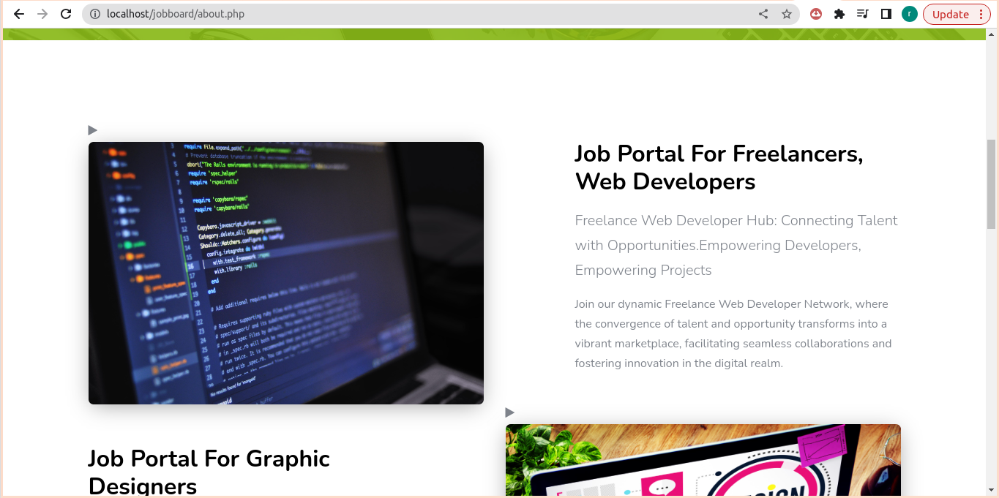
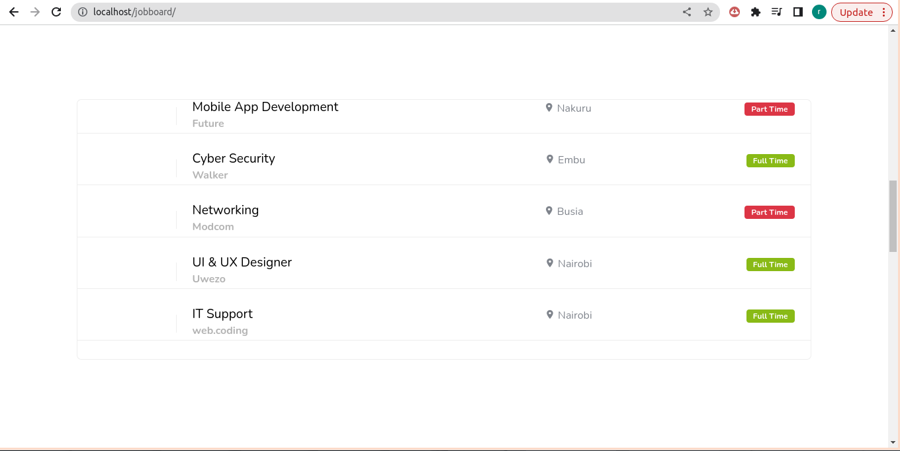
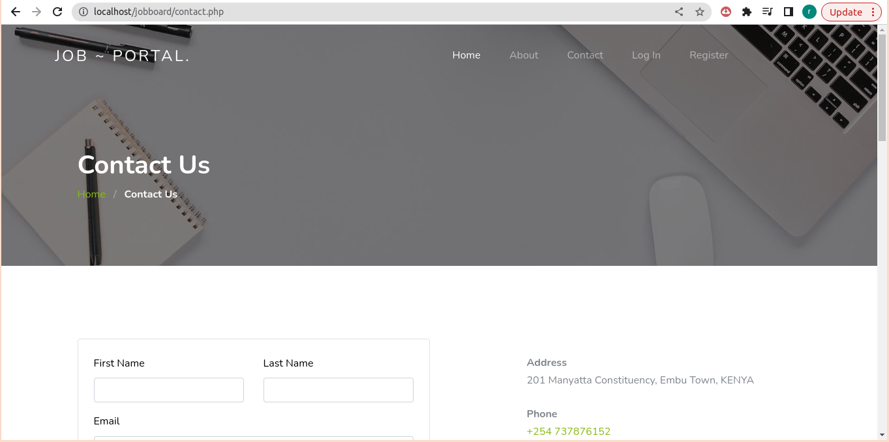

# Job Website
# Overview
This repository hosts a dynamic job website developed using PHP, MySQL database, and hosted on a local server. The job website serves as a platform for both job seekers and employers to connect, facilitating the process of job search and recruitment.

# Features
- Job Listings: Users can browse through a comprehensive list of job openings across various industries and sectors. 
- Search Functionality: The website offers robust search capabilities, allowing users to filter job listings based on criteria such as job title, location, company, and job type. 
- User Registration and Authentication: Job seekers and employers can create accounts, providing them with personalized experiences and access to additional features.
- Job Application: Job seekers can apply for desired positions directly through the website, simplifying the application process. 
- Employer Dashboard: Employers have access to a dedicated dashboard where they can post new job listings, manage existing postings, and review applications from prospective candidates.
- Responsive Design: The website is designed to be responsive, ensuring optimal viewing and functionality across various devices and screen sizes. 
# Technologies Used
- PHP: The backend logic and server-side scripting are implemented using PHP, providing dynamic content generation and interaction with the MySQL database. 
- MySQL Database: The website relies on a MySQL database to store and manage job listings, user accounts, and other relevant data. 
- Localhost: The website is hosted on a local server environment for development and testing purposes. It allows for rapid iteration and debugging before deployment to a production environment. 
# Installation
To set up the job website locally, follow these steps:

- Clone the repository to your local machine.
- Install a local server environment such as XAMPP or WAMP.
- Import the provided MySQL database schema.
- Configure the database connection settings in the PHP files.
- Access the website through the localhost URL in your web browser.
# Usage
- Job Seekers: Register an account, browse job listings, apply for positions, and manage applications through the user dashboard. 
- Employers: Register as an employer, post job listings, manage postings, and review applications from job seekers via the employer dashboard.
# Contributing
Contributions to the development of this job website are welcome! Feel free to fork the repository, make improvements or add new features, and submit pull requests.

# Preview

